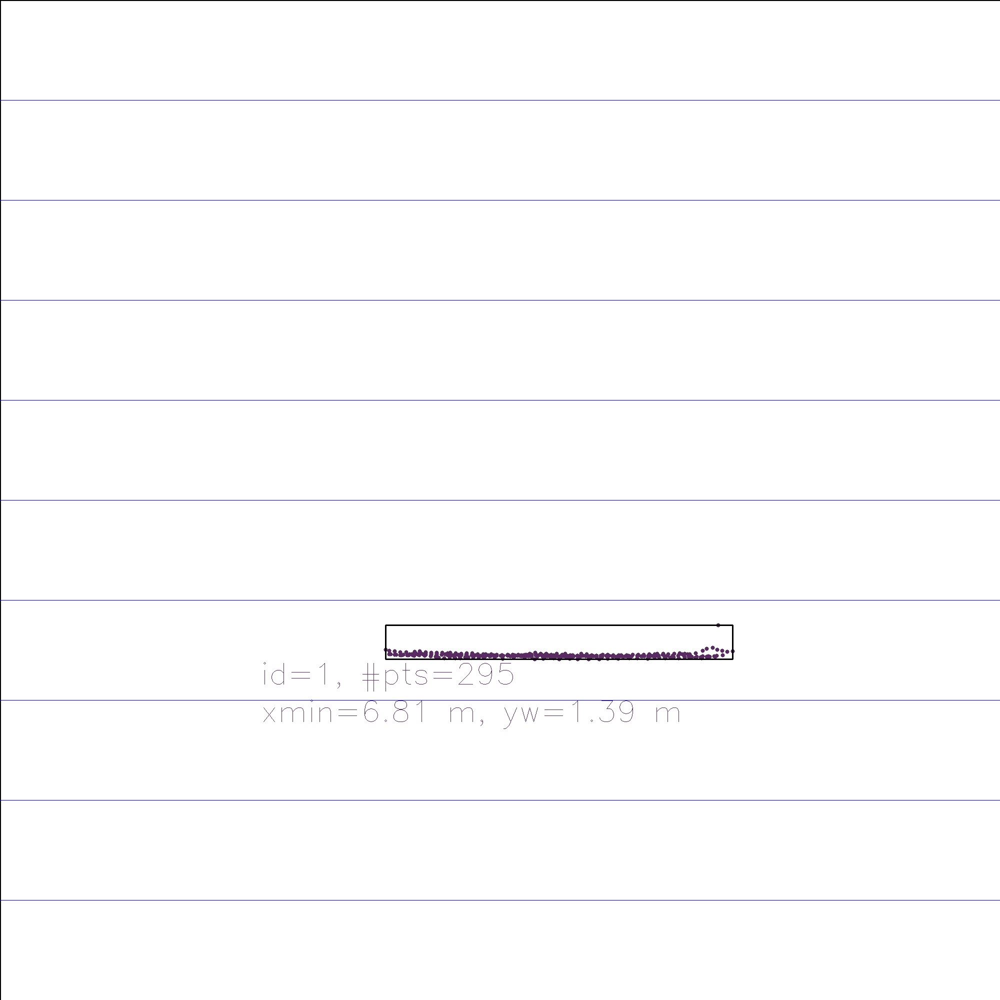
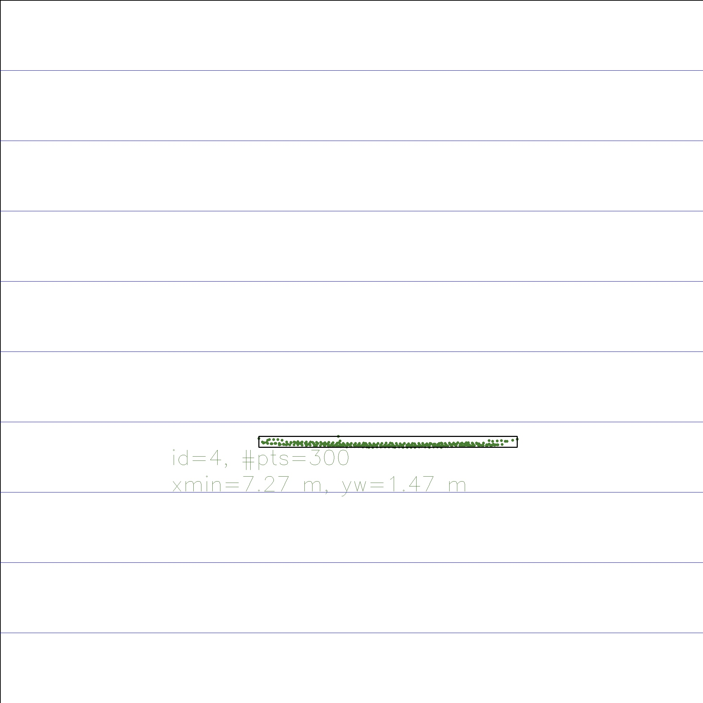
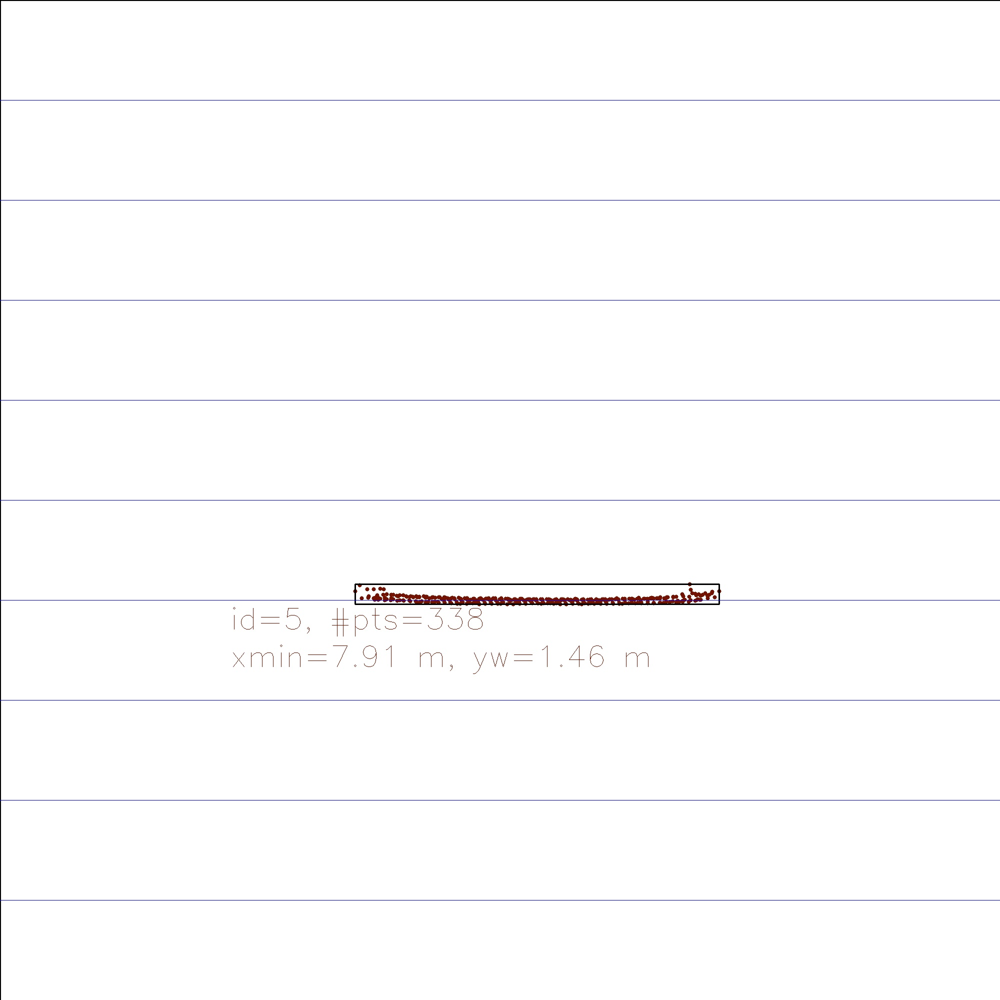

# SFND 3D Object Tracking

Welcome to the final project of the camera course. By completing all the lessons, you now have a solid understanding of keypoint detectors, descriptors, and methods to match them between successive images. Also, you know how to detect objects in an image using the YOLO deep-learning framework. And finally, you know how to associate regions in a camera image with Lidar points in 3D space. Let's take a look at our program schematic to see what we already have accomplished and what's still missing.

In this final project, you will implement the missing parts in the schematic. To do this, you will complete four major tasks: 
1. First, you will develop a way to match 3D objects over time by using keypoint correspondences. 
2. Second, you will compute the TTC based on Lidar measurements. 
3. You will then proceed to do the same using the camera, which requires to first associate keypoint matches to regions of interest and then to compute the TTC based on those matches. 
4. And lastly, you will conduct various tests with the framework. Your goal is to identify the most suitable detector/descriptor combination for TTC estimation and also to search for problems that can lead to faulty measurements by the camera or Lidar sensor. In the last course of this Nanodegree, you will learn about the Kalman filter, which is a great way to combine the two independent TTC measurements into an improved version which is much more reliable than a single sensor alone can be. But before we think about such things, let us focus on your final project in the camera course. 

## Dependencies for Running Locally
* cmake >= 2.8
  * All OSes: [click here for installation instructions](https://cmake.org/install/)
* make >= 4.1 (Linux, Mac), 3.81 (Windows)
  * Linux: make is installed by default on most Linux distros
  * Mac: [install Xcode command line tools to get make](https://developer.apple.com/xcode/features/)
  * Windows: [Click here for installation instructions](http://gnuwin32.sourceforge.net/packages/make.htm)
* Git LFS
  * Weight files are handled using [LFS](https://git-lfs.github.com/)
* OpenCV >= 4.1
  * This must be compiled from source using the `-D OPENCV_ENABLE_NONFREE=ON` cmake flag for testing the SIFT and SURF detectors.
  * The OpenCV 4.1.0 source code can be found [here](https://github.com/opencv/opencv/tree/4.1.0)
* gcc/g++ >= 5.4
  * Linux: gcc / g++ is installed by default on most Linux distros
  * Mac: same deal as make - [install Xcode command line tools](https://developer.apple.com/xcode/features/)
  * Windows: recommend using [MinGW](http://www.mingw.org/)

## Basic Build Instructions

1. Clone this repo.
2. Make a build directory in the top level project directory: `mkdir build && cd build`
3. Compile: `cmake .. && make`
4. Run it: `./3D_object_tracking`.

## Processes

### Match 3D Objects

The function `matchBoundingBoxes` is implemented, which takes as input both the previous and the current data frames and provides as output the ids of the matched regions of interest (i.e. the boxID property)“.

###  Compute Lidar-based TTC

The function `computeTTCLidar` is implemented, which aims to compute the time-to-collision for all matched 3D objects based on Lidar measurements alone. 

### Associate Keypoint Correspondences with Bounding Boxes

Before a TTC estimate can be computed in the next step, we need to find all keypoint matches that belong to each 3D object. We do this by simply checking whether the corresponding keypoints are within the region of interest in the camera image. The function `clusterKptMatchesWithROI` is implemented to associate a given bounding box with the keypoints it contains.

### Compute Camera-based TTC

Once keypoint matches have been added to the bounding boxes, the next step is to compute the TTC estimate. The function `computeTTCCamera` is implemented to estimate the TTC.

## Performance Evaluation

You can check the file `summary.csv` and `comparison.csv` for a summary of the performing duration of all combination of detectors and descriptors.

Take the combination BRISK + SIFT for example, by evaluating the consecutive change of the TTC, we can see that from frame 3 to 4, 4 to 5, we have very variable TTC estimation.

| Detector Type | Descriptor Type | Frame ID | Lidar-Based TTC [ms] | Camera-Based TTC [ms] | delta_TTC_Lidar   | delta_TTC_camera  |
|---------------|-----------------|----------|----------------------|-----------------------|-------------------|-------------------|
| SIFT          | BRISK           | 0        | 0                    | 0                     |                   |                   |
| SIFT          | BRISK           | 1        | 12.28909987          | 11.59171107           |                   |                   |
| SIFT          | BRISK           | 2        | 13.35472472          | 13.05343562           | 1.06562485        | 1.46172455        |
| SIFT          | BRISK           | 3        | 16.38445235          | 13.5439638            | 3.02972763        | 0.49052818        |
| SIFT          | BRISK           | 4        | 14.07644542          | 23.14746663           | 2.30800693        | 9.60350283        |
| SIFT          | BRISK           | 5        | 12.72994538          | 15.07248356           | 1.34650004        | 8.07498307        |
| SIFT          | BRISK           | 6        | 13.75107388          | 18.05369097           | 1.0211285         | 2.98120741        |
| SIFT          | BRISK           | 7        | 13.73143194          | 14.05220574           | 0.01964194        | 4.00148523        |
| SIFT          | BRISK           | 8        | 13.79012564          | 14.99624675           | 0.058693699999999 | 0.944041010000001 |
| SIFT          | BRISK           | 9        | 12.05899411          | 13.40374977           | 1.73113153        | 1.59249698        |
| SIFT          | BRISK           | 10       | 11.86418535          | 13.34836661           | 0.194808760000001 | 0.05538316        |
| SIFT          | BRISK           | 11       | 11.96819706          | 12.75878545           | 0.10401171        | 0.58958116        |
| SIFT          | BRISK           | 12       | 9.88711316           | 10.25182774           | 2.0810839         | 2.50695771        |
| SIFT          | BRISK           | 13       | 9.42503692           | 9.57844085            | 0.46207624        | 0.67338689        |
| SIFT          | BRISK           | 14       | 9.30214768           | 11.99146839           | 0.122889239999999 | 2.41302754        |
| SIFT          | BRISK           | 15       | 8.32120023           | 9.94639385            | 0.98094745        | 2.04507454        |
| SIFT          | BRISK           | 16       | 8.89867334           | 9.99809361            | 0.57747311        | 0.05169976        |
| SIFT          | BRISK           | 17       | 11.03011361          | 9.52960439            | 2.13144027        | 0.46848922        |

Here are the visualized image of the corresponding frames. And we guess that on the frame 4, many keypoints are distinguished as the outlier, so the matching between the frames are of lower quality, which leads to a variable TTC estimation.

And from the output of all combinations, we can see that the HARRIS & ORB detector cannot provide very stable keypoints for the later process. For instance, HARRIS detector will lead to 5 NAN TTC estimations out of 18 frames, while ORB detector leads to around 4 NAN estimations. A detailed summary is to be seen in file `summary.csv`. By comparing the stable estimated TTC, the average estimated TTC and also the deviation, we come to the conclusion that the top 3 combinations are the SHITOMASI	+ SIFT, SHITOMASI + FREAK and SHITOMASI + ORB.

| Detector Type | Descriptor Type | Minimal Lidar-Based TTC [ms] | Minimal Camera-Based TTC [ms] | Maximal Lidar-Based TTC [ms] | Maximal Camera-Based TTC [ms] | Mean Lidar-Based TTC [ms] | Mean Camera-Based TTC [ms] | Median Lidar-Based TTC [ms] | Median Camera-Based TTC [ms] | Standard Deviation Lidar-Based TTC [ms] | Standard Deviation Camera-Based TTC [ms] |
|---------------|-----------------|------------------------------|-------------------------------|------------------------------|-------------------------------|---------------------------|----------------------------|-----------------------------|------------------------------|-----------------------------------------|------------------------------------------|
| SHITOMASI     | SIFT            | 8.5215662                    | 11.65240646                   | 16.68938579                  | 14.66179588                   | 11.92520088               | 13.30973435                | 12.51559999                 | 13.31594842                  | 5.19616539                              | 0.70704912                               |
| SHITOMASI     | FREAK           | 8.5215662                    | 10.29696335                   | 16.68938579                  | 14.23851761                   | 11.92520088               | 12.41917862                | 12.51559999                 | 12.53539806                  | 5.19616539                              | 0.81132855                               |
| SHITOMASI     | ORB             | 8.5215662                    | 10.25917779                   | 16.68938579                  | 14.02073142                   | 11.92520088               | 12.46626117                | 12.51559999                 | 12.20221886                  | 5.19616539                              | 1.08523257                               |
| FAST          | BRISK           | 8.5215662                    | 9.29330386                    | 16.68938579                  | 16.61627335                   | 11.92520088               | 12.39122291                | 12.51559999                 | 12.27828007                  | 5.19616539                              | 2.03356517                               |
| FAST          | BRIEF           | 8.5215662                    | 9.93546392                    | 16.68938579                  | 16.7839297                    | 11.92520088               | 13.01305325                | 12.51559999                 | 12.85314552                  | 5.19616539                              | 2.2906966                                |
| SHITOMASI     | BRIEF           | 8.5215662                    | 10.72119379                   | 16.68938579                  | 18.33675542                   | 11.92520088               | 13.20789723                | 12.51559999                 | 12.97883177                  | 5.19616539                              | 2.5551436                                |
| SHITOMASI     | BRISK           | 8.5215662                    | 9.33784559                    | 16.68938579                  | 15.59966843                   | 11.92520088               | 12.57780011                | 12.51559999                 | 12.06116059                  | 5.19616539                              | 2.56161781                               |
| SIFT          | SIFT            | 8.5215662                    | 8.69190216                    | 16.68938579                  | 18.81833163                   | 11.92520088               | 12.05005023                | 12.51559999                 | 11.68818225                  | 5.19616539                              | 5.23837784                               |
| AKAZE         | AKAZE           | 8.5215662                    | 10.30410056                   | 16.68938579                  | 18.24973978                   | 11.92520088               | 14.25402082                | 12.51559999                 | 13.9009689                   | 5.19616539                              | 5.34912523                               |
| AKAZE         | BRISK           | 8.5215662                    | 10.08550739                   | 16.68938579                  | 19.8382557                    | 11.92520088               | 14.29675952                | 12.51559999                 | 13.92294059                  | 5.19616539                              | 5.43070106                               |
| FAST          | SIFT            | 8.5215662                    | 10.5264212                    | 16.68938579                  | 22.75053551                   | 11.92520088               | 13.80549497                | 12.51559999                 | 12.89299692                  | 5.19616539                              | 6.80944908                               |
| AKAZE         | SIFT            | 8.5215662                    | 9.89602831                    | 16.68938579                  | 19.56416752                   | 11.92520088               | 14.52597367                | 12.51559999                 | 14.28655391                  | 5.19616539                              | 6.91801748                               |
| AKAZE         | BRIEF           | 8.5215662                    | 10.19392674                   | 16.68938579                  | 20.09001813                   | 11.92520088               | 14.55816929                | 12.51559999                 | 14.23112854                  | 5.19616539                              | 7.68977102                               |
| SIFT          | FREAK           | 8.5215662                    | 8.72478844                    | 16.68938579                  | 20.51434433                   | 11.92520088               | 12.44312333                | 12.51559999                 | 12.88770637                  | 5.19616539                              | 7.82190827                               |
| AKAZE         | FREAK           | 8.5215662                    | 9.87627006                    | 16.68938579                  | 20.16914836                   | 11.92520088               | 13.78525667                | 12.51559999                 | 14.03604183                  | 5.19616539                              | 7.97731948                               |
| BRISK         | ORB             | 8.5215662                    | 11.4475207                    | 16.68938579                  | 19.4255732                    | 11.92520088               | 15.17315928                | 12.51559999                 | 14.92014902                  | 5.19616539                              | 8.05997653                               |
| AKAZE         | ORB             | 8.5215662                    | 10.38465508                   | 16.68938579                  | 18.91159065                   | 11.92520088               | 14.55767896                | 12.51559999                 | 13.98105685                  | 5.19616539                              | 8.16938896                               |
| SIFT          | BRIEF           | 8.5215662                    | 9.26161932                    | 16.68938579                  | 21.30869629                   | 11.92520088               | 12.85452261                | 12.51559999                 | 12.25078809                  | 5.19616539                              | 8.71037022                               |
| SIFT          | BRISK           | 8.5215662                    | 9.52960439                    | 16.68938579                  | 23.14746663                   | 11.92520088               | 13.19517264                | 12.51559999                 | 13.05343562                  | 5.19616539                              | 11.20773333                              |
| BRISK         | FREAK           | 8.5215662                    | 9.24577145                    | 16.68938579                  | 22.30572088                   | 11.92520088               | 15.18754978                | 12.51559999                 | 14.61228132                  | 5.19616539                              | 13.26462833                              |
| BRISK         | BRISK           | 8.5215662                    | 9.70105372                    | 16.68938579                  | 25.18679838                   | 11.92520088               | 15.29378109                | 12.51559999                 | 14.97037538                  | 5.19616539                              | 17.11715337                              |
| BRISK         | SIFT            | 8.5215662                    | 11.04517347                   | 16.68938579                  | 33.00193011                   | 11.92520088               | 15.01120783                | 12.51559999                 | 13.54067035                  | 5.19616539                              | 24.14782386                              |
| BRISK         | BRIEF           | 8.5215662                    | 11.05396722                   | 16.68938579                  | 41.77857112                   | 11.92520088               | 19.03013546                | 12.51559999                 | 17.32649496                  | 5.19616539                              | 44.7608775                               |
| HARRIS        | BRIEF           | 8.5215662                    | 5.60609668                    | 16.68938579                  | 35.38326278                   | 11.92520088               | 14.26434014                | 12.51559999                 | 12.58484487                  | 5.19616539                              | 58.58355168                              |
| ORB           | ORB             | 8.5215662                    | 8.28796092                    | 16.68938579                  | 30.27671319                   | 11.92520088               | 18.16532736                | 12.51559999                 | 17.56083656                  | 5.19616539                              | 60.57208997                              |
| ORB           | FREAK           | 8.5215662                    | 7.0586596                     | 16.68938579                  | 54.17730572                   | 11.92520088               | 18.42087483                | 12.51559999                 | 12.20744536                  | 5.19616539                              | 178.73377135                             |
| FAST          | FREAK           | 8.5215662                    | 11.02964013                   | 16.68938579                  | 74.60606407                   | 11.92520088               | 16.18842026                | 12.51559999                 | 12.32915027                  | 5.19616539                              | 214.78390481                             |
| HARRIS        | BRISK           | 8.5215662                    | -80.85253316                  | 16.68938579                  | 17.62038152                   | 11.92520088               | -0.06031918                | 12.51559999                 | 11.24371765                  | 5.19616539                              | 788.77836088                             |
| ORB           | BRIEF           | 8.5215662                    | -48.15195469                  | 16.68938579                  | 93.01489514                   | 11.92520088               | 22.6213323                 | 12.51559999                 | 24.76010279                  | 5.19616539                              | 875.33494027                             |
| HARRIS        | FREAK           | 8.5215662                    | -80.85253316                  | 16.68938579                  | 39.58402863                   | 11.92520088               | 4.85943939                 | 12.51559999                 | 12.20818802                  | 5.19616539                              | 891.15888498                             |
| FAST          | ORB             | 8.5215662                    | 10.71327484                   | 16.68938579                  | 199.15665412                  | 11.92520088               | 26.46477761                | 12.51559999                 | 12.87112632                  | 5.19616539                              | 1968.1405927                             |
| HARRIS        | SIFT            | 8.5215662                    | -13.62628318                  | 16.68938579                  | 568.32220463                  | 11.92520088               | 46.53332533                | 12.51559999                 | 11.57921595                  | 5.19616539                              | 19562.46085794                           |
| HARRIS        | ORB             | 8.5215662                    | 5.66096575                    | 16.68938579                  | 568.32220463                  | 11.92520088               | 63.86823409                | 12.51559999                 | 12.24499411                  | 5.19616539                              | 25501.73982748                           |
| ORB           | BRISK           | 8.5215662                    | 7.47226123                    | 16.68938579                  | 596.74523275                  | 11.92520088               | 82.12162154                | 12.51559999                 | 20.68873365                  | 5.19616539                              | 26567.09415275                           |
| ORB           | SIFT            | 8.5215662                    | 7.86152181                    | 16.68938579                  | 11213.49667976                | 11.92520088               | 774.5248513                | 12.51559999                 | 17.52216741                  | 5.19616539                              | 7784655.48142679                         |