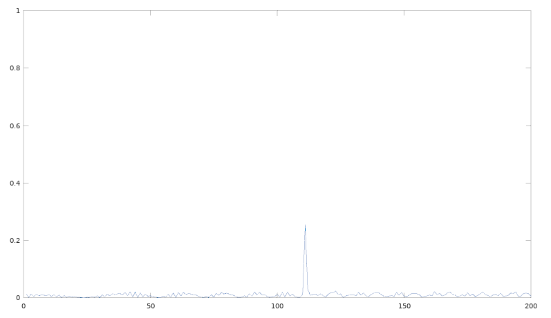
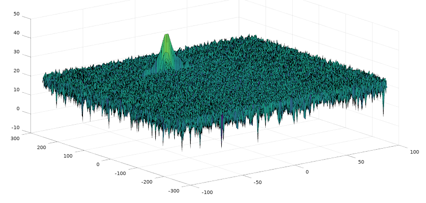
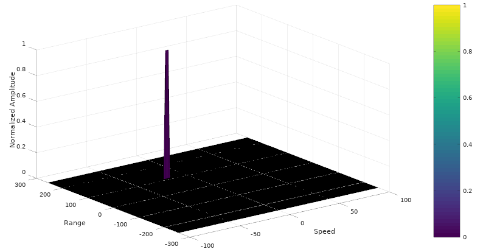

# Radar Target Generation and Detection

### Project Overview

- Configure the FMCW waveform based on the system requirements.
- Define the range and velocity of target and simulate its displacement.
- Determine the beat signal for the same simulation loop process the transmit and receive signal. 
- Perform Range FFT on the received signal to determine the Range.
- Perform the CFAR processing on the output of 2nd FFT to display the target.

### Project Layout


### Workflow

1. Radar System Requirements

    

    ```matlab
    %% Radar Specifications 
    %%%%%%%%%%%%%%%%%%%%%%%%%%%
    % Frequency of operation = 77GHz
    % Max Range = 200m
    R_max = 200;
    % Range Resolution = 1 m
    range_resolution = 1;
    % Max Velocity = 100 m/s
    max_vel = 100;
    %%%%%%%%%%%%%%%%%%%%%%%%%%%
    ```

2. Initialization

    ```matlab
    %% User Defined Range and Velocity of target
    % initial distance of the target
    R_init = 110;
    % speed of the target (-70 - 70)
    v_init = -20;
    ```

3. FMCW Waveform Generation

    ```matlab
    %% FMCW Waveform Generation
    % Design the FMCW waveform by giving the specs of each of its parameters.
    % Calculate the Bandwidth (B), Chirp Time (Tchirp) and Slope (slope) of the FMCW
    % chirp using the requirements above.

    % Compute the sweep bandwidth
    Bsweep = c / (2 * range_resolution);

    % Compute the sweep time and chirp slope
    Tchirp = 5.5 * 2 * R_max / c;
    slope = Bsweep / Tchirp;
    ```

   Next step is simulating the signal propagation and move target scenario.

   

    ```matlab
    %% Signal generation and Moving Target simulation
    % Running the radar scenario over the time. 

    for i = 1 : length(t)
        % For each time stamp update the Range of the Target for constant velocity. 
        r_t(i) = R_init + v_init * t(i);
        td(i) = 2 * r_t(i) / c;
        
        % For each time sample we need update the transmitted and
        % received signal. 
        Tx(i) = cos(2 * pi * (fc * t(i) + slope * t(i)^2 / 2));
        Rx(i) = cos(2 * pi * (fc * (t(i) - td(i)) + slope * (t(i) - td(i))^2 / 2));
        
        % Now by mixing the Transmit and Receive generate the beat signal
        % This is done by element wise matrix multiplication of Transmit and
        % Receiver Signal
        Mix(i) = Tx(i) * Rx(i);
    end
    ```

4. FFT Operation

    - Implement the 1D FFT on the Mixed Signal
    - Reshape the vector into Nr*Nd array.
    - Run the FFT on the beat signal along the range bins dimension (Nr)
    - Normalize the FFT output.
    - Take the absolute value of that output.
    - Keep one half of the signal
    - Plot the output

    ```matlab
    %% RANGE MEASUREMENT
    %reshape the vector into Nr*Nd array. Nr and Nd here would also define the size of
    %Range and Doppler FFT respectively.
    Mix_reshape = reshape(Mix, Nr, Nd);

    %run the FFT on the beat signal along the range bins dimension (Nr) and
    %normalize.
    sig_fft1 = fft(Mix_reshape, Nr) / Nr;

    % Take the absolute value of FFT output
    sig_fft1 = abs(sig_fft1);

    % Output of FFT is double sided signal, but we are interested in only one side of the spectrum.
    % Hence we throw out half of the samples.
    sig_fft1 = sig_fft1(1 : Nr/2);
    ```
    
   The 1st FFT output shows that there is a peak at the initial position of the target, which indicates the target located at around 110 meters

   


   2st FFT generates a Range Doppler Map (RDM) stored in variable ‘RDM’. 
   
   

5. 2D CFAR

   
    1. Determine the number of Training cells and guard cells for each dimension.

    

    ```matlab
    %% CFAR implementation
    % Slide Window through the complete Range Doppler Map

    % Select the number of Training Cells in both the dimensions.
    Tr = 12;
    Td = 8;

    % Select the number of Guard Cells in both dimensions around the Cell under 
    % test (CUT) for accurate estimation
    Gr = 4;
    Gd = 4;
    ```
    2. Slide the cell under test across the complete matrix. Make sure the CUT has margin for Training and Guard cells from the edges.
    
    3. For every iteration sum the signal level within all the training cells. To sum convert the value from logarithmic to linear using db2pow function. Average the summed values for all of the training cells used. After averaging convert it back to logarithmic using pow2db. Further add the offset to it to determine the threshold.
    4. Compare the signal under CUT against this threshold. If the CUT level > threshold assign it a value of 1, else equate it to 0.
    
    ```matlab
    % Normalize the RDM
    RDM = RDM/max(max(RDM));

    %Create a vector to store noise_level for each iteration on training cells

    % design a loop such that it slides the CUT across range doppler map by
    % giving margins at the edges for Training and Guard Cells.
    % For every iteration sum the signal level within all the training
    % cells. To sum convert the value from logarithmic to linear using db2pow
    % function. Average the summed values for all of the training
    % cells used. After averaging convert it back to logarithimic using pow2db.
    % Further add the offset to it to determine the threshold. Next, compare the
    % signal under CUT with this threshold. If the CUT level > threshold assign
    % it a value of 1, else equate it to 0.
    for i = (Gr + Tr + 1) : (Nr / 2 - Gr - Tr)
        for j = (Gd + Td + 1) : (Nd - Gd - Td)
            % Determine the noise threshold by measuring it within
            % the training cells
            training_cells = db2pow(RDM((i-Gr-Tr):(i+Gr+Tr), (j-Gd-Td):(j+Gd+Td)));
            
            % exclude the guard cells
            training_cells((Tr+1):(Tr+2*Gr+1), (Td+1):(Td+2*Gd+1)) = 0;
            % noise_level = sum(training_cells, 'all');
            noise_level = sum(sum(training_cells));

            area = 2 * (Td + Gd + 1) * 2 * (Tr + Gr + 1) - (Gr * Gd) - 1;
            threshold = pow2db(noise_level / area) + offset;
            
            % Use RDM[x,y] as the matrix from the output of 2D FFT for implementing
            % CFAR
            RDM(i, j) = int8(RDM(i, j) >= threshold);
        end
    end

    % The process above will generate a thresholded block, which is smaller 
    % than the Range Doppler Map as the CUT cannot be located at the edges of
    % matrix. Hence,few cells will not be thresholded. To keep the map size same
    % set those values to 0. 
    RDM(RDM~=0 & RDM~=1) = 0;
    ```

    The output is shown as below:

    